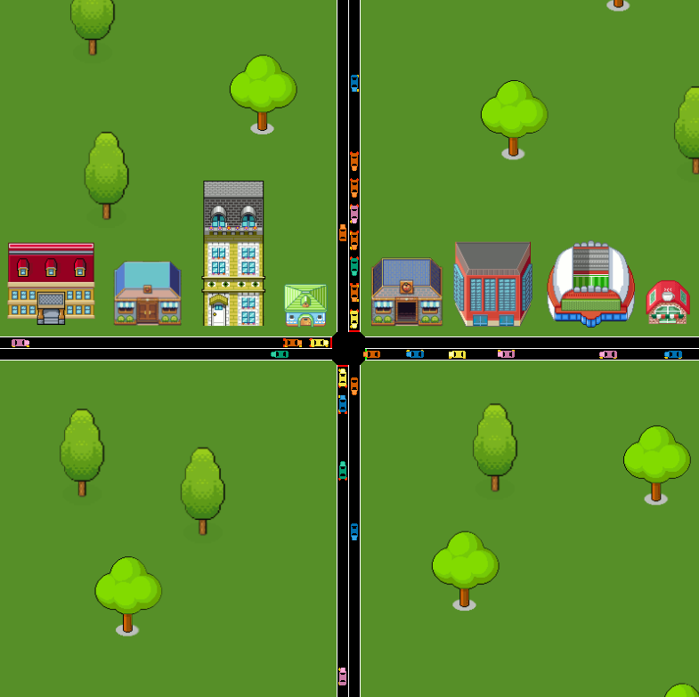

# Junction Jam

Jam at the junction - can you beat the queues and get the cars past the traffic lights faster than everyone else? Interactive traffic simulation for all ages.

An open source traffic light control game for engagement events with potential for crowd sourcing data. See it in action on [YouTube](https://youtu.be/o_phwO31nIk)

**INSTALLATION GUIDE:** [READ HERE](./INSTALLATION.md).

*Please acknowledge the author and other relevant contributors in any derivative works. Not for commercial use.*   
*Copyright 2017: [Craig B. Rafter](https://github.com/cbrafter)*   
*Distributed under [GNU GPL-3.0](./LICENSE)*   

## Description
A simple crossroads simulated using the [TraCI](http://sumo.dlr.de/wiki/TraCI) [Python](https://www.python.org/) API to the [SUMO](http://www.sumo.dlr.de/) microsimulator. The program maps the keyboard arrow keys to control the direction of the traffic flow using the [Pynput](https://pypi.python.org/pypi/pynput) Python library. The *sumoAPI* included is from the [Traffic Control Test Set](http://tctester.sourceforge.net/).

The simulation is capable of storing the results localy and diplaying them on a web page. Or posting the results online to [Twitter](https://twitter.com/) using the Python [Twitter API](https://github.com/bear/python-twitter). The user defined names are limited to 4 characters and filtered for profanity. A separate server scipt is provided to update the results from the twitter feed periodically. Users will need to provide their own twitter API crednetials in `twitAuth.py`

The background was created using [GIMP](https://www.gimp.org/), art credits below. Given the intention of displaying this to a wide audience, the vehicles are colored in a color blind accessible color palette. See [(B. Wong, 2011)](http://www.nature.com/nmeth/journal/v8/n6/full/nmeth.1618.html) for details of the color palette.

## Future work
- Log user data so that machine learning can be applied to good user scores.
- Make a two-player junction for cooperative play.

## Screenshot

## Requirements
System built and tested on:
- Ubuntu 16.04.1 LTS
- SUMO 0.29.0
- Python 2.7
- Pynput 1.2
- Python Profanity 1.1
- Python Twitter 3.2.1

## Acknowledgements
### Pixel Art:
**Trees:**
- René Alejandro Hernández [HERE](https://design.tutsplus.com/tutorials/how-to-create-an-isometric-pixel-art-tree-in-adobe-photoshop--cms-23606)
- User "shimauma" [HERE](https://forum.unity3d.com/threads/pixel-art-how-to-keep-original-sprite-size-in-game.241281/)

**Buildings:**
- User "JSena" [PixelJoint](http://pixeljoint.com/pixelart/44722.htm)
- User "duyvi" [PixelJoint](http://pixeljoint.com/p/9540.htm)
- User "Matriax" [PixelJoint](http://pixeljoint.com/p/644.htm)

### Color blind accessible color palette
Wong, B. *"Points of view: Color blindness"*, Nature Methods, 8, 441, 2011, [doi:10.1038/nmeth.1618](http://www.nature.com/nmeth/journal/v8/n6/full/nmeth.1618.html) 
